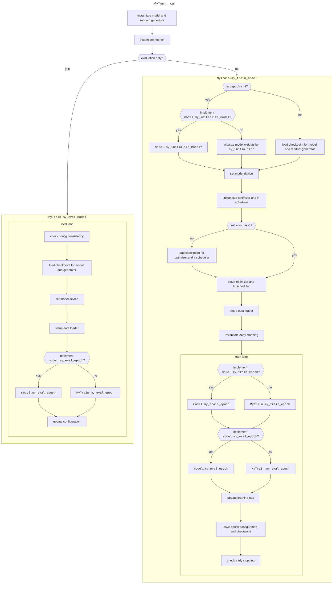
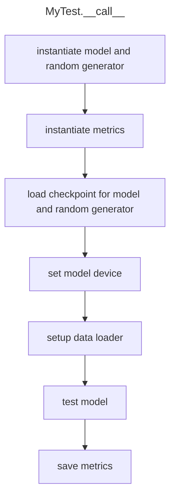

# Introduction

This repository contains AI libraries commonly used for all my AI projects.

# Train

The `MyTrain` class train subclass of huggingface `PreTrainedModel`. `model.state_dict` and `model.load_state_dict` must be consistent.

# Test

The `MyTest` class test subclass of huggingface `PreTrainedModel`. `MyTest` will load the epoch saved by `MyTrain`. If `model.my_train_model` is implemented, then the corresponding `model.my_load_model` is necessary.

# Metric

The metric classes should implement three methods.
1. `__init__` intialized the parameters and metric state.
2. `step` process the batchs. It receives:
    - `df`: the data frame returned by the model's `eval_output` method.
    - `examples`: the examples in the dataset.
    - `batch`: the batch returned by the model's `data_collator`.
3. `epoch` accumulate all batch results, reinitialize the metric state and return the final metric.
